# リポジトリを眺めてみる

ここまででリポジトリにちょっとした操作を行ってもらいます。

## ログを見る

ここまでの変更がどのような流れで行われ、誰が手を入れたのかについては、 `git log`で確認できます。
また、ブラウザ上でも確認できます。

今回は最低3回はコミットしているのでログを見るとそれだけのコミットが発生しているはずです。

```pwsh
PS> git log
```

ターミナルを占有する形でページャーが動いています。読み終わったら`q`キーで終了して上げてください。
はみ出している場合はカーソルキー上下か`j`/`k`キーでスクロールできます。

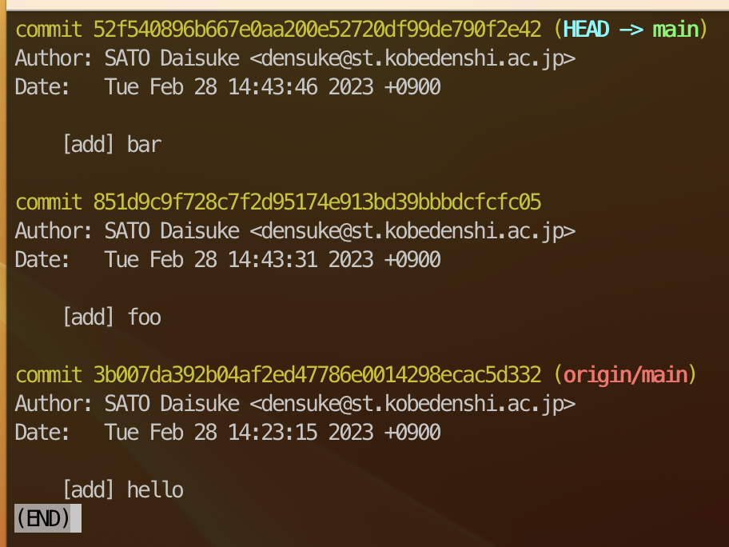

````{tip}
よりグラフ指向の出力を見たい場合、 `--graph`オプションを付けると良いでしょう。

```pwsh
PS> git log --graph
```

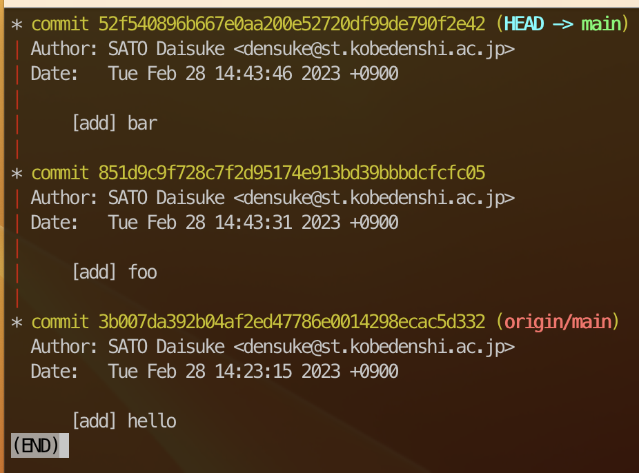
````

ログについては、ブラウザ上でもう少しきれいに見ることもできます。

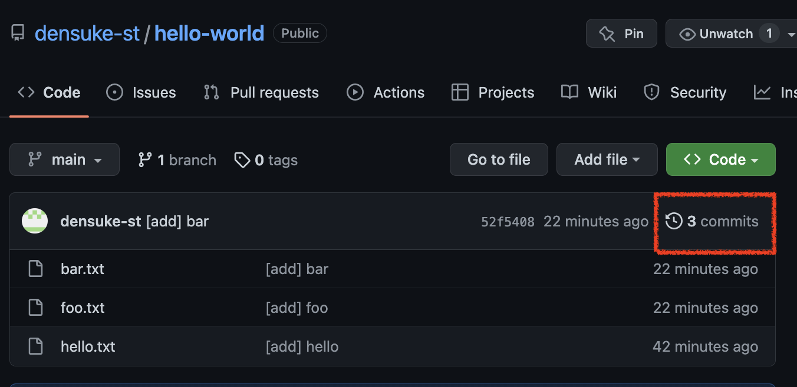

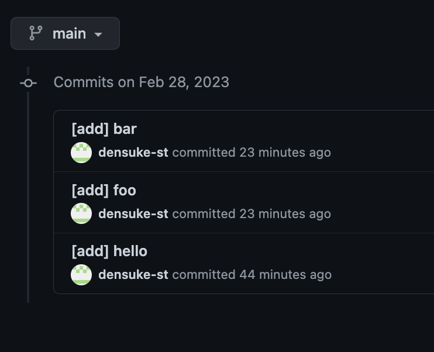

実際の開発では、多くの開発者が別で開発していた物を組み込むようなことも多いので、賑やかになったりもします。
また、ブランチベースの開発をしている場合も賑やかになります。

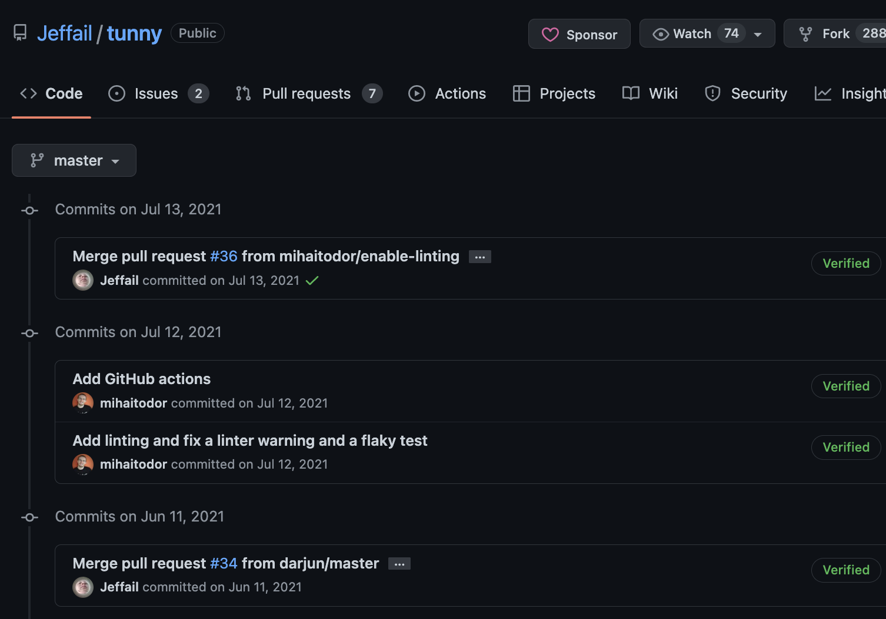

- [Jeffail/tunny](https://github.com/Jeffail/tunny/commits/master)

## 変更点を知る

全てのコミットは繋がっているため、あるコミットから別のコミットの間で、どのような変化が発生したのかを、`git diff`にて取得できます。

例えば最新の状態(3回以上コミットしている)と、2つ前の状態で比較をしてみます。
最新のコミット状態(厳密にはちょっと違う)は、 **HEAD** という名前で指すことができます。
このHEADから2つ前という状態は、 **HEAD^^**(もしくは**HEAD~2**)で示せます。

```pwsh
PS> git diff HEAD^^..HEAD # HEAD^^からHEADへの差分抽出
```

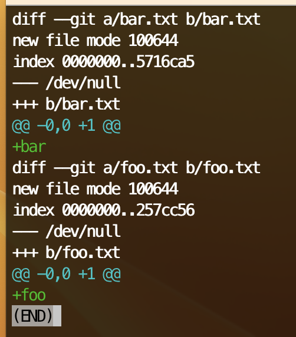

この場合なにもないところ(`/dev/null`)からファイル`foo.txt`および`bar.txt`が生成されたことを示す差分(Uniffied Diff形式)が取得できています。

```{note}
1つ前のコミットからの差分(`HEAD^..HEAD`)も抽出してみましょう。
先ほどと違う結果になると思われます。
```

## 変更を巻き戻す

あるあるな話として、余計なコードを加えて挙動を悪くしてしまったというのがあると思います。
gitにおけるコミットは、ある種の**セーブポイント**的要素であり、指定の状態に巻き戻すことや、未コミットの変更を破棄したりすることが可能です。
ただこの操作を学ぶためには、コミットに対するブランチ(ラベル)を少しだけ知っておく必要があります。

ブランチ(branch)は、コミットの繋がった一連の状態を指します。

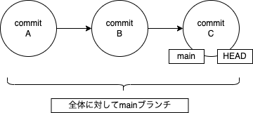

基本的にブランチの最先端にラベルとしてのブランチ名がつきますし、同時に最後のコミット位置であるHEADというラベルも重なって付与されています。
HEADの位置をずらすことで前の状態を取得することもできます。

```pwsh
PS> git checkout HEAD^ # ひとつ前に移動
```

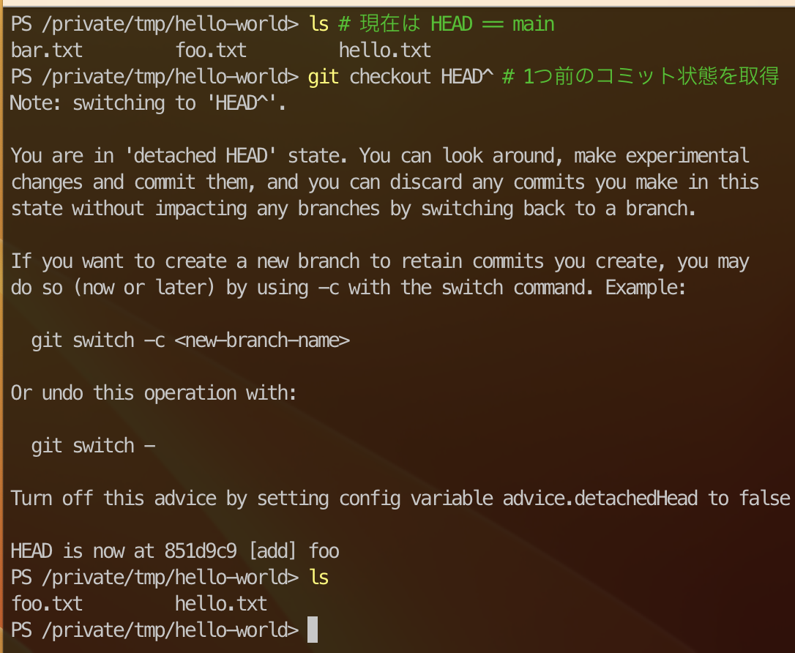

前後でファイルが1つ減ったことが確認できます。

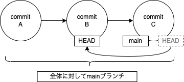

ラベルとしてのmainはそのままmainブランチの先端を指しているので、checkoutしなおせば復帰できます。

```pwsh
PS> git checkout main # 復帰
```

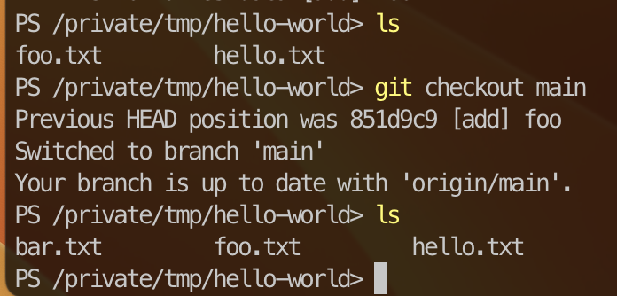

比較の結果、コミット自体を取り消したいのであれば、`git revert`を使うことで、コミットを打ち消すコミット(逆コミット)を発生させることでなかったことにできます。

```pwsh
PS> git revert # 最後のコミットをrevert
```

このとき、内蔵viが動くことがあるので操作に戸惑うかもしれませんが、キー入力でおちついて`:`→`q`→`Enterキー`で復帰できます。
無事revertされると、打ち消しコミットが記録されます。

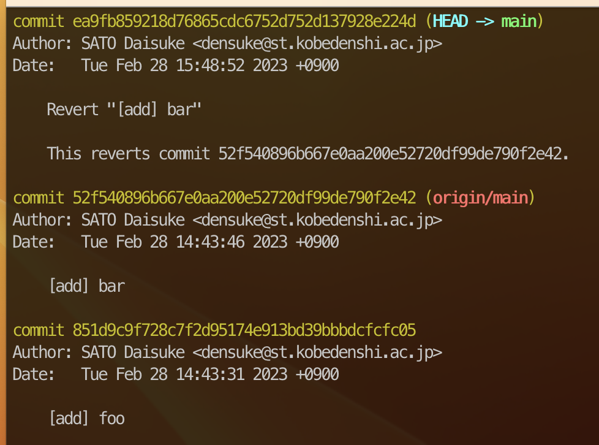

```{tip}
重要なポイントとして **打ち消しをするだけであり、過去のコミットの事実を消していない** というところがあります。
コミット自体を取り消すという方法が皆無ではないのですが、歴史の修正という行為になってしまうためあまり褒められたものではありません。
```

```{note}
特定のファイルだけ元に戻さないといけないケースもあるかもしれません、そういう時は、一度以前のコミットに戻って該当ファイルをコピーしておき、元に戻って書き換えて(上書きして)コミットするという方法もあったりします。少し邪悪な感じになりますが、現実的にはやりたくないけどやってしまうことがあります。
```

