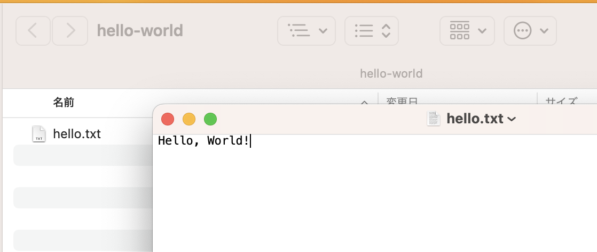
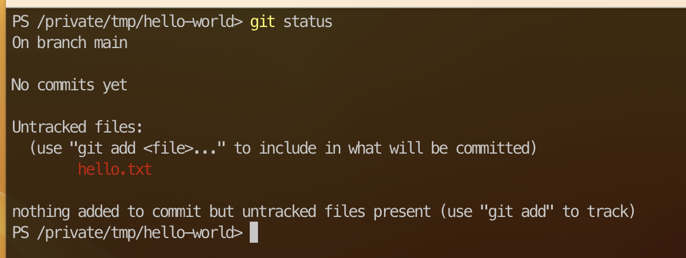
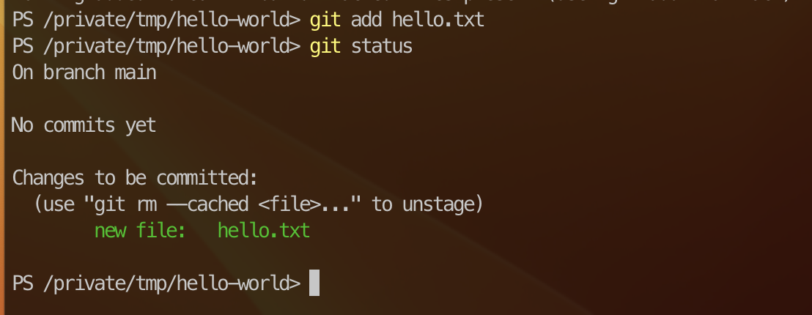

# ファイルを置いてコミットしてみよう

では、ワークツリーの中に適当なファイルを配置してみます。

## hello.txtの作成

ここでは、ファイル `hello.txt` を作ってみましょう。
中身はなんでも良いですが、初期状態のリポジトリは外部へ公開する設定(public)のため、当たり障りの無いもので `Hello, World!`の一文を入れておきます。



## 次コミットへの追加

このとき、gitは今作ったファイル hello.txt に関しては **追跡していないファイル** として認識されます。
追跡されないため、gitの管理下におかれず、変更しても気付けません。
現在の状態は `git status` コマンドにて確認できます。



管理下に置くための操作として、 `git add` を使います。

```pwsh
PS> git add hello.txt # hello.txt を追跡するよう追加
PS> git status # 現在の状態を確認
```



```{tip}
ファイルを渡す代わりに `.` を使えば、**カレントディレクトリ以下の未追跡・変更のあったファイルを追加**にできます。
ディレクトリを渡せば、そのディレクトリ以下に対して同様の挙動を示します。
```

`git add` 操作をすることで、__Untracked__ から **Changes to be committed** に切り替わっています。
これにより、次のコミット時に現在の変更状態(`hello.txt`ファイル)が追加されることになります。

```{tip}
少しだけ厳密にすると、 `git add` により、変更のあったファイルを **ステージ** という空間(たまにキャッシュと言われる)に登録します。
ステージに上がった状態のファイルを次のコミットに登録するという流れです。

そのため、ステージに上げたファイルをコミットせずに編集した場合、もう一度ステージに上げ直さないと、変更が反映されないこともあります。
```

## コミット処理

次のコミットに含めたいファイルを全て`add`したら(今回はファイル1つですが)、その内容でコミットを行います。

```pwsh
PS> git commit -m "[add] hello"
```

`-m "文字列"` は **コミットメッセージ** というもの(MessageのM)で、このコミットにより**どういう変化が入るのか**を記入するためのものです。
`-m` 無しでも実行可能ですが、エディタ(内蔵viエディタ)が起動するため、未経験の方にとっては大変なことになってしまいます(普通の人は使えるはずなんですけどね〜)。


この処理により、現在の `hello.txt` ファイルはコミットされ、追加時の状態が固定化された状態でリポジトリ内に蓄積されたことになります。
実際、`git status`で確認すると、変更点がないという形で戻ります。

````{tip}
gitの初期設定(名前とメールアドレス登録)をやっていないとここで詰みます。
おちついて登録作業を行ってからやり直せば通ります。

```pwsh
PS> git config --global user.name "名前(ローマ字推奨)"
PS> git config --global user.email "メールアドレス" #GitHubに登録したメールアドレスで
PS> git commit -m "[add] hello" # やりなおす
```

````


ただし同時に、**Your branch is based on 'origin/main', but the upstream is gone.**というメッセージが付与されています。
現状ではまだ理解に苦しむところかと思いますが、大雑把に解釈すると **上流(upstream)にそんなブランチはありません** という感じになります。


