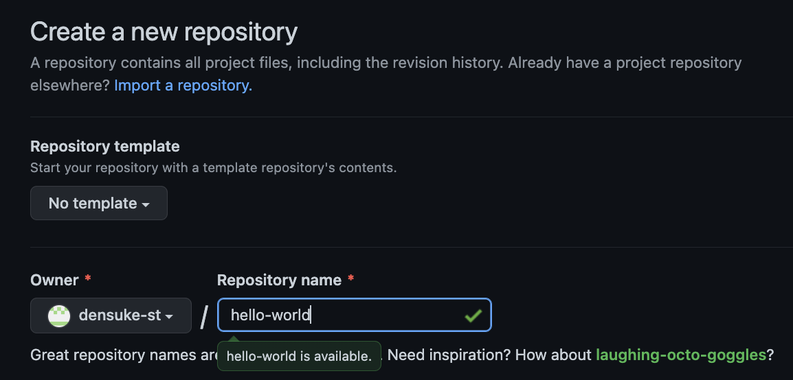

# GitHub上でのリポジトリ作成

まず、GitHub上でリポジトリ(コミットの保存領域)を作ります。
作成するリポジトリは `hello-world` としておきます。
[GitHub](https://github.com/)に接続し、リポジトリの作成(Newボタン)を行います。

リポジトリの名前を聞いてきますので、 `hello-world` と入れてください。
各自のユーザー名を名前空間として使われるので、同じ名前にしても衝突は起きません。

以降の設定はあとで `settings` にて概ね変更可能ですので、今はあまり気にしないでおいてください。
下へスクロールし、 `Create repository` ボタンを押せばリポジトリが作成されます。

現状では空っぽのリポジトリのため、この後どうするのかがコマンドで示されます。
リポジトリにファイルが投入されれば、この表示は消えます。
状況に応じて、指定のコマンドを入力すればローカル環境のセットアップも可能なのですが、ここではQuick Setupにある内容を利用して行います。

