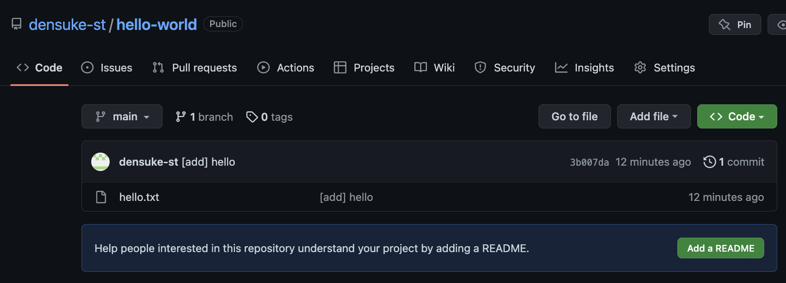

# 上流へのプッシュ

前の段階では、ローカルでのコミットを一度行った状態です。
このコミットをクローン元(=上流)に送ることで、自分の変更をGitHub上に記録しておくことができます。
GitHub上で共有開発している人たちにも、自分の変更を得ることができるようにもなります。
この操作をプッシュ(push)と言います。

## 実際にプッシュしてみる

それではプッシュ操作をしてみましょう。 `git push` で行えます。

```pwsh
PS> git push
```


プッシュできると、自分のローカルでのコミットがGitHub側に送付され、半ば同期された状態となります。
ブラウザで空のリポジトリ状態だったはずのページをリロードすると、作った `hello.txt` が出現し、クリックすれば中身も参照可能です。




## もっとやってみよう

`hello.txt` ファイル以外に適当なファイル(個人情報を入れないこと)を作成し、順次追加(`git add`)してコミット(`git commit`)してみましょう。
コミット処理の際、 `-m "メッセージ"` を忘れずに付けてください。作業自体が適当なため、メッセージが思いつきにくいと思います。
今回は「〜を追加」などで十分です。

この工程を、最低2度(最初のものとあわせて3回以上のコミット)を行ってみてください。
もちろん一度追加しているファイルを書き換えて再度コミットしてもらってもかまいません。


`foo.txt`と`bar.txt`を作成してコミット

プッシュ作業は最後に一度行えば良いのですが、その前に一度 `git status`してみてください。


上流とローカルの間でコミット状態の相違がある場合、いくつ相違があるかが確認できます。
概ねコミット回数ですが、厳密には違います(2回のコミットなのに3とか4とかいうことも普通におきます)。


