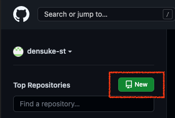
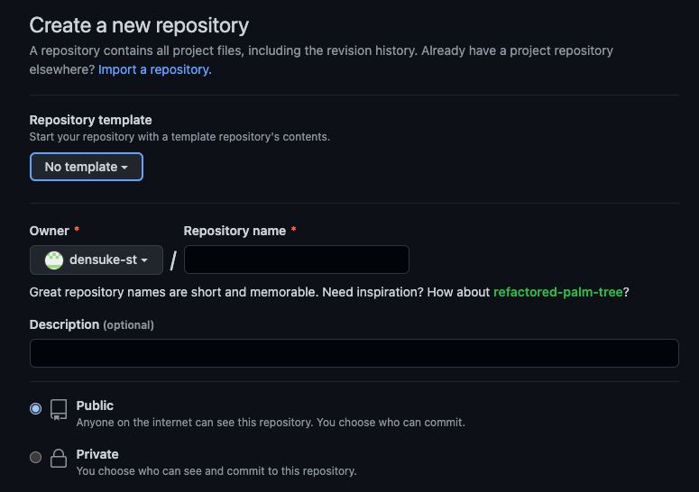
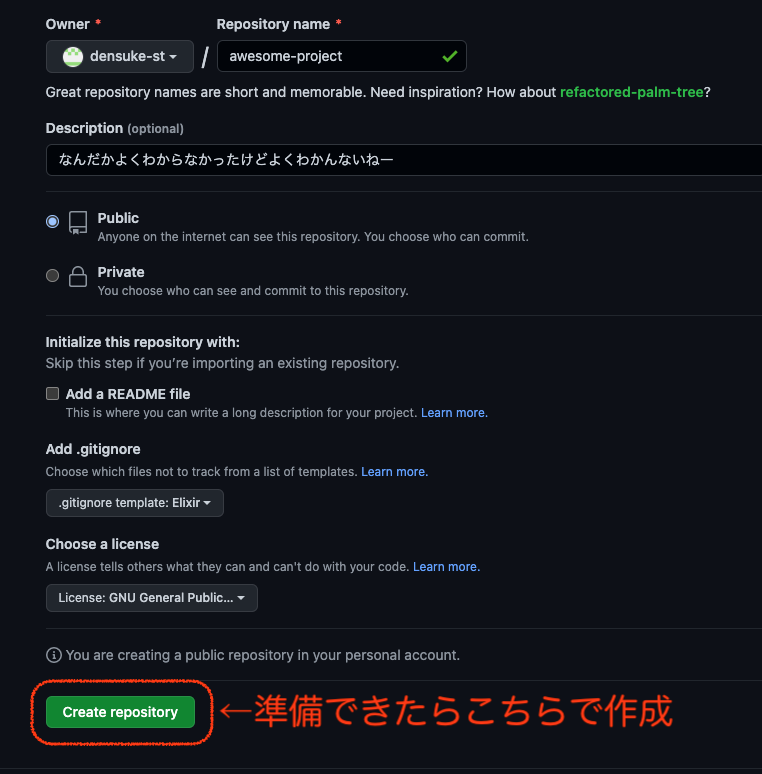
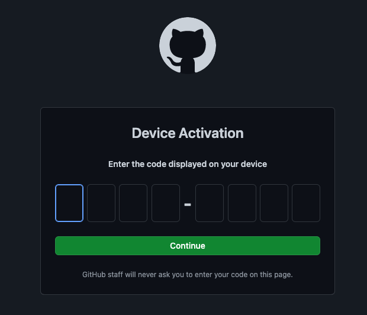
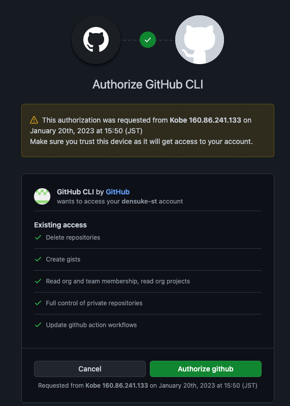
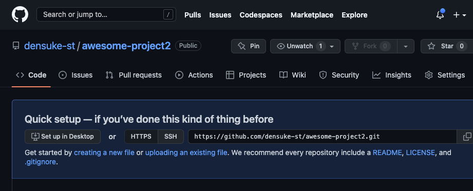

# 空のリモートリポジトリの作成

では実際にリモートリポジトリを作成してみましょう。
[GitHub](https://github.com/)に接続して、新規リポジトリの作成を指示します。





入力するべき最低限の部分は最初のひとつだけです。

- Owner/Repository name: リポジトリの所有者(owner)は自分のIDなので普通はそのまま、Repository nameの側は既存の(自分の)リポジトリ名と被らなければ英数字と一部記号(ハイフンやアンダースコアなど)が使えます

移行は任意です、後で変更することも可能です。

- Description: リポジトリの持つものの説明
- 可視性: リポジトリを外部に公開するかです、どちらかは選ぶ必要がありますがデフォルトでPublicになっています
    - Public: 外部からリンクで指すことも可能です、検索で発見されることもあります
    - Private: 自身および招待したユーザーのみが見えます
- Initialize this repository with: 各種設定の追加です
    - Add a README file: 最初にREADMEファイルを作成(してからコミット)するか
    - Add `.gitignore`: `.gitignore` ファイルを作成するか、するとしてどういう環境を想定したものとするか
    - Choose a license: ライセンス規定を決めている場合はそれを選択しておいてください

以上の確認をした後、 `Create repository` ボタンを押すことで作成されます。



これで作成完了です。完了すると、表示が切り替わります。


この例では、 `.gitignore` ファイルの事前作成を指示していたため、初期コミットが既に行われた形になっています。
作成を指示していない場合、空のリポジトリが生成されます(これはこれでOK)。

# `gh` コマンドによる作成

GitHub CLIをインストールした場合、`gh`コマンドが使えます。初回利用時はブラウザが開いて、GitHub操作用の権限(トークン)取得が行われますが、
その後は `gh` コマンドを用いることで、リポジトリ操作が行えるようになります。

## 初回認証

`gh`コマンドで操作するときに利用する認証トークンの取得を行います。

```zsh
% gh auto login # 初回の設定(認証)

? What account do you want to log into?  [Use arrows to move, type to filter]
> GitHub.com      <--- こちらを指定
  GitHub Enterprise Server
? What is your preferred protocol for Git operations?  [Use arrows to move, type to filter]
> HTTPS   <--- こちらを指定
  SSH
? How would you like to authenticate GitHub CLI?  [Use arrows to move, type to filter]
> Login with a web browser
  Paste an authentication token
(パソコン上の端末を使っている場合は"Login with a web browser"にて、リモート開発環境であれば"Paste an authentication token"で)

! First copy your one-time code: 7E36-2A92
Press Enter to open github.com in your browser...

```


ここで認証コードを入力


認証後、端末側では認証トークンを取得し、作業が進みます。

```zsh
Press Enter to open github.com in your browser...
✓ Authentication complete.
- gh config set -h github.com git_protocol https
✓ Configured git protocol
✓ Logged in as densuke-st
```

## リポジトリの作成

使えるようになれば、コマンドライン上でリポジトリ作成が行えます。

```zsh
# awesome-project2を作成、可視性はPublicで
% gh repo create awesome-project2 --public
✓ Created repository densuke-st/awesome-project2 on GitHub

# ブラウザでリポジトリを開く
% gh repo view --web awesome-project2
```



`gh` コマンドの細かい使い方については、適宜オンラインで検索してみてください。
