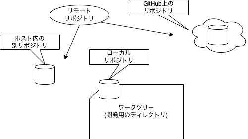
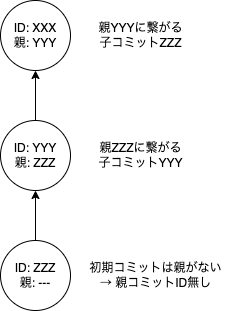

# リポジトリとリモート名

GitHubにおいて、現在のストレージ上のリポジトリではないところは全てリモートリポジトリとなります。

- GitHubなどネットワーク越しにあるリポジトリを参照している場合、それはリモートリポジトリと扱われます
- また、同じホスト(マシン)上で別のディレクトリにもともとのリポジトリが存在していてそれを参照していれば、それもリモートリポジトリとして扱われます

つまり、自分以外の関連リポジトリはすべてリモートとなります。

リモートのリポジトリは、URL形式(ネットワーク越し)、ディレクトリへのパス(ストレージ上)で表現することになりますが、それは普段指定するには長すぎるため、リモート名というものを用いて表現します。

- origin: ローカルのリポジトリの参照(クローン)元となったもの、ローカルと同じ内容を持ちうる存在
- upstream: originが参照したリポジトリ(上流)

これら以外にも、複数のリモートを適宜参照する場合もありますが、複雑になるのでとりあえず2つだけあればそれほど困らないと思います。

# Gitでのリポジトリはなにを持っていたのか

ここでGitの仕組みのことを少しおさらいしておく必要があります。
リポジトリには、コミット情報(コミットオブジェクト)が収納されています。
コミット情報は、それぞれを区別するためのID(コミットID)が用意されています。
各コミットは、自分の親となる(元の状態を持っている)コミットのIDが納められているため、各コミットオブジェクトをスキャンすることで、コミットの親子関係を遡って作成できるというモノでした。

このコミットオブジェクトは、upstreamをベースとしてoriginを生成したときに(その時点での)upstream上のコミットオブジェクトは全てコピーして所有しています。
そのoriginをクローンした以上、originが持っていたコミットオブジェクトはローカルのリポジトリにも存在しているはずです。
結果的にローカルのリポジトリ上にも、upstream上のコミットが存在していることになります。

