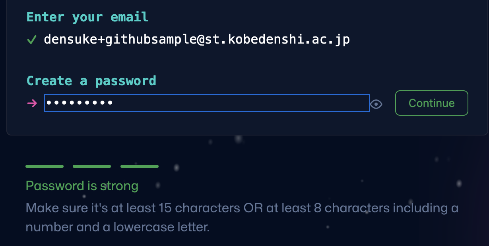
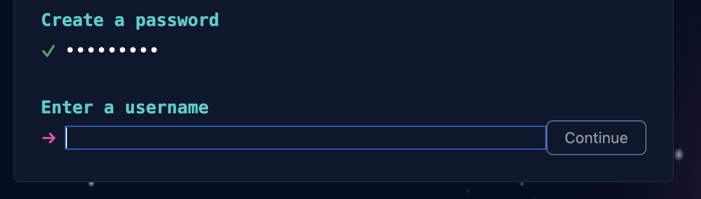
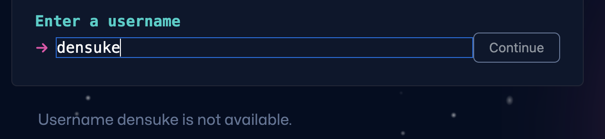
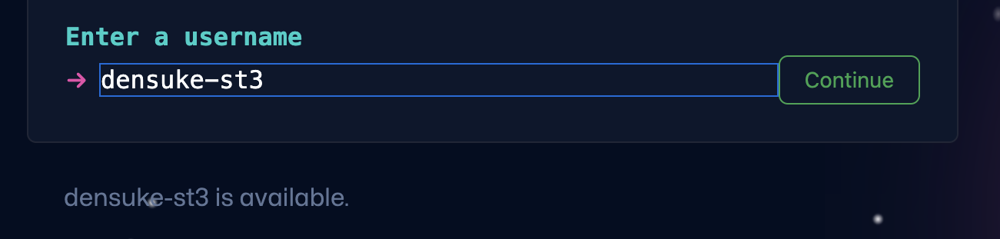
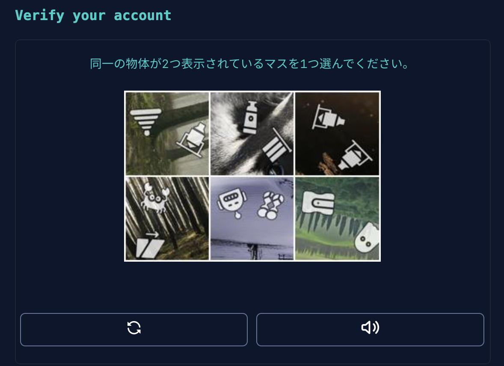
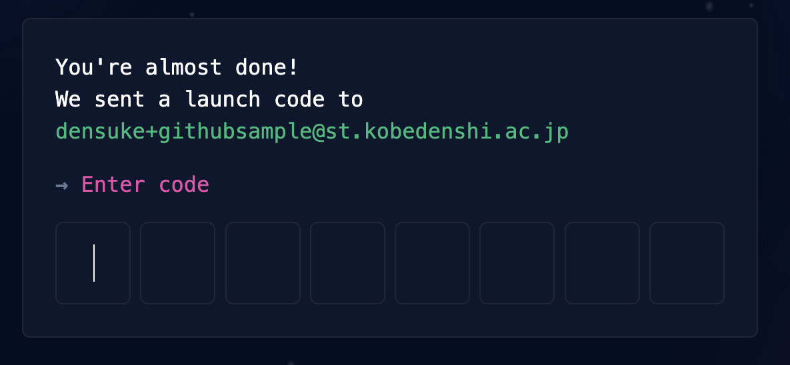

# GitHub 利用の準備

この文書では、Gitのリモートリポジトリとして [GitHub](https://github.com/) を用います。
こちらの利用には、アカウント(GitHubアカウント)が必要になりますので、まずアカウントを作成していきましょう。
アカウントの作成自体はWeb上で簡単に作成します。

## 必要な環境

この作業には以下の環境が必要になります、確認してから進めましょう。

- Webブラウザ(Chrome, Safari, Edgeなど一般的なものであればOK)
- メールアドレスおよびメールを確認する環境
- 基本的な英文読解力
    - GitHubのサイト(UIまわり)はほとんど日本語化されていません、いちいち翻訳通しながらとかやってたら日が暮れます
    - ドキュメントはある程度日本語化されていますが、原文(英文)の更新に即時対応しているとは限りません


```{note}
セキュリティ確保のため、携帯電話の番号(SMSによる認証のため)やコード生成のできるAuthenticator(Google Authenticator等)を追加で設定できます。
```

```{note}
GitHubアカウントは無料ですが、有料プラン(上位プラン)が存在します。

- [Pricing](https://github.com/pricing)

また、個人向けであればProアカウントがあり、こちらは学生であれば2年単位(学生であれば更新可能)で無料で切り替えることができます。
仮想マシンのレンタル時間向上(月あたり 120時間/コア → 180時間/コア)などのメリットもあるので、切り替えにチャレンジしてみるのも良いでしょう。ネット上で切り替え手順の日本語での紹介等があるので、検索してみてください。

- [GitHub pro](https://docs.github.com/en/get-started/learning-about-github/githubs-products#github-pro)
- [GitHub Education](https://education.github.com/benefits/offers)

```

# GitHubアカウントの作成

まずブラウザで、[GitHub](https://github.com/)にアクセスしてください。


少し下にスクロールすると、メールアドレスを入力して開始する事ができるので、
自分のメールアドレスを入力してください。


学校の授業で使うものですので、できる限り学校での自分のメールアドレスを渡すようにしてください。

```{note}
手入力をすると、入力を間違えてしまうことがかなりあるので、メールのアプリなどから **自分のメールアドレスをコピペして入れる** ようにしましょう。
ここで間違えると後で面倒なことになります。
```

入力後 "Sign up for GitHub" を押すことで、次の手順に進めます。

まずメールアドレスの確認が出るので、確認して次へ進めましょう。


続いて、パスワードを決めるよう促されます、適当に決めてください(忘れないようにすること)。
このとき入力したパスワードの強度が示されるので、 **strong** と判定される程度には難しいものにしてください。



そして、GitHub上で使われるユーザー名(他の人に見えます)を設定します。
重複して使えない場合はその旨が出ますので、ほかのユーザーとぶつからないものにしましょう。




既に使われている場合は、"not available"と出ています。


利用可能であれば、"available"と出ています、こちらになるように決めてください。


サービスの更新情報などをメールで送って良いかを求めてきます。
任意ですのでy/nお好みで入れてすすめてください。


『検証する』のボタンの後、人間の入力である(ボット入力ではない)ことの確認が行われるのでがんばって解いてください。


無事通過できれば、アカウント作成が可能になるので、"Create account"ですすめてください。


ここで登録したアドレスにメールが届いていることをチェックしてきてください。
届いているメールに確認用のコードが入っています。



コードを渡すことにより、メールアドレスの(疎通)確認が完了します。
その後パーソナライズ用の質問がいくつか続くかと思いますが、無いようにしたがって進めてもかまいませんし、下にあるskipで飛ばしてもらってもかまいません。

```{note}
このとき、なぜか"flagged"とされることがあります。
というかこの記事を作っているときにやられました。


なぜなったのかというのは利用者である私たちの側からではわからない事が多いと思います。
この場合は、[Contact Support](https://github.com/contact)にて問い合わせをして解除してもらう必要があります。

解除方法の先駆者のサイトもありますので、こちらの例文を参考に送ってみると良いでしょう。

- [GitHubでアラート! Your account has been flaggedが表示されたよ -- エクスプラボ](https://ekulabo.com/github-account-flagged)
- [リクエスト送信先(アカウント - GitHub)](https://support.github.com/contact/account)
```

# Gitコマンドのインストール

```{note}
Gitコマンドをインストール済みであればこの部分はスキップできます。
```

Gitの操作を行う上で、必ず必要になるGitコマンドをインストールしておきます。

- [Git](https://git-scm.com/)

こちらで自分の使っているOS版のGitのインストーラーをダウンロードしてインストールしてください。
ただし、インストーラー経由よりも、各OSの持つツールで入れた方が管理しやすいかもしれませんので、そちらをオススメします。

## Windows11のwingetによるインストール

`winget` コマンドが使える環境であれば、管理者のPowerShell端末からコマンドで入れることができます。

```ps1
PS> winget install --id Git.Git -e --source winget
```

## macOSのbrewによるインストール

macOS利用者であれば普通に `brew` は導入していることでしょう。
こちらでも普通にインストールできます。

```zsh
% brew install git
```

# オプショナル: GitHub CLIのインストール

GitHubの操作をコマンドで行える`gh`コマンドを使いたい場合は、追加でインストールしておきましょう。

- [GitHub CLI](https://cli.github.com/)

手順に沿って入れてもらえれば、 `gh`コマンドが利用可能になります。
地味に便利です。
