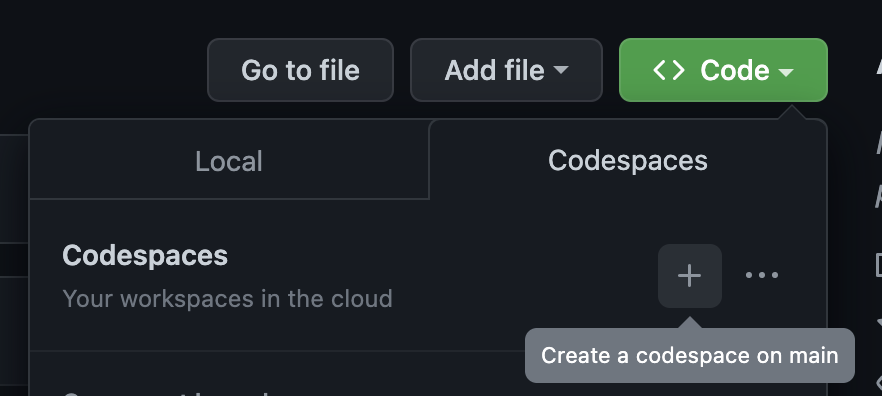
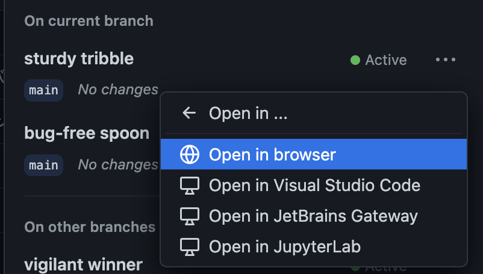
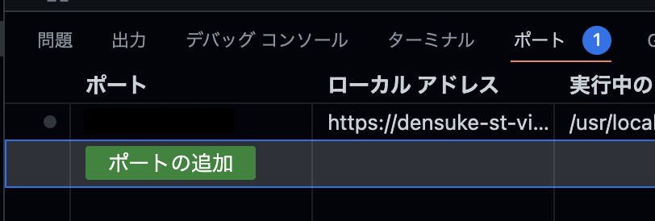
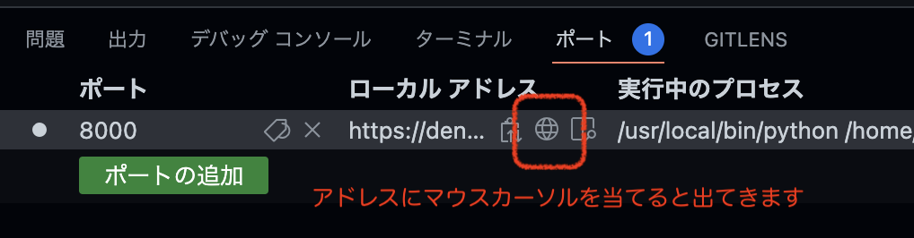

# VisualStudio Codespacesでの開発

ブラウザだけあれば(細かい操作の違いはありますが)開発も可能です。
Codespaceの初期設定は事前に行っておいてください。

1. ブラウザでリポジトリを開きます
2. Codespaceの起動を指示します
    
3. この際、ブラウザからローカルのVSCodeに引き継ごうとします(設定によっては自動的に繋がることもあります、そうしたい方はそれでもかまいませんが、この場合はローカルでのVSCodeの件に準じます)、ここではキャンセルしておきます
    
4. 改めてCodespacesの項目を見ると、GitHub上のVMが構築されているので、3点ボタン(`…`)の部分にある `Open in →` にてブラウザからの起動を指示してください
    
5. devcontainerの設定に従い、環境構築が行われ、ブラウザ上でVSCodeが開いて操作可能となります。

## ポートフォワード(マッピング)について

devcontainerの設定に基づいて動いているため、同様に自動ビルドが働いています。
しかしながら、ローカル環境と異なり、自動的なポートマッピングは行われません。

こちらについては、VSCode上の『ポート』にて、8000番を手動で追加することで、ローカルアドレスが生成されるので、そちらをブラウザで開いてもらえば同様に処理されます。

1.  『ポート』タブを開きます、以下の図では既に別のポートを開いている状態ですが、初期状態はおそらくなにもないと思います
    
2. 『ポートの追加』ボタンを押して、8000番を追加してください(書いてからEnterキー)
    
3. ローカルアドレスが生成されるので、地球マーク(ブラウザ起動)を押すことでブラウザ上で開かれます(タブまたは新規ウィンドウ)
    

これでブラウザ上だけでも開発が可能です。

## 注意点

Codespacesは有料のサービスですが、**無料枠**があり、GitHubアカウントを持っていれば誰でも利用可能です。

- GitHubの無料アカウントであれば **1ヶ月当たり120時間/コア** 
    - 初期設定では2コアのVMが生成されるので、60時間が上限となります
- 有料アカウント/学生・教員向けProアカウントであれば **1ヶ月あたり180時間/コア**

接続のないVMは2時間程度(設定による)で自動的に閉じた状態(CPU利用が停止する)になり、未使用状態が14日(設定による)続くとVMは自動的に破棄されます。
**作業中のデータはVM破棄時に消滅する**ので注意してください。

また、ストレージ容量も月あたりの無料枠がありますが、本テキストの執筆において無料枠を超えるような事はおそらくないと思います。
いずれにしても課金が発生し得る場合には事前に警告メッセージ(メール)があるのでそれを参考にしてください。

詳細については、GitHub上のドキュメントを参考にしてください。

- [Codespaces | GitHub](https://github.co.jp/features/codespaces)